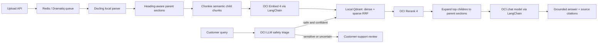

# prodRAG

Lightweight production RAG for roughly 10–30 technical documents or FAQ files. Document
contents are parsed locally and stored in a local Qdrant server. OCI Generative AI is used
for safety triage, embedding, reranking, and grounded answer generation through LangChain.

## B2B SaaS support demo

The repository includes nine fictional NimbusFlow support documents (eight Markdown and one HTML FAQ), labeled retrieval cases,
and a PowerShell demo for billing, API limits, authentication, and integration failures. The
query response now includes ticket category, confidence, human-review routing, and sensitive-data
types. An OCI LLM performs structured safety triage before retrieval. Sensitive tickets stop
after triage and are routed to the secure customer-support queue without embedding, reranking,
or automatic answer generation.

See [B2B SaaS support demo](docs/b2b-saas-demo.md) for the test flow and
[OCI cost estimate](docs/cost-estimate.md) for the per-1,000-query calculation.

## Architecture



The ingestion worker writes a new checksum-based revision before deleting stale vectors.
If parsing or embedding fails, the previous good revision stays searchable. Point IDs are
deterministic, making retries idempotent.

## Code layout

Each module has one main responsibility:

- `ingestion/parsing.py` extracts Markdown and structure-aware parent sections.
- `ingestion/chunking.py` creates semantic child chunks inside each parent.
- `ingestion/service.py` builds deterministic metadata and upserts document revisions.
- `retrieval/hybrid_search.py` defines the dense-and-sparse search contract.
- `retrieval/sparse.py` supplies local BM25 sparse embeddings.
- `retrieval/reranking.py` contains the OCI reranker adapter.
- `retrieval/context.py` deduplicates children and expands winning parent sections.
- `retrieval/confidence.py` grades retrieval confidence independently from the LLM.
- `retrieval/service.py` orchestrates search, reranking, filtering, and context assembly.
- `vector_store.py` owns Qdrant collection, HNSW/exact settings, upserts, and RRF fusion.
- `prompts.py`, `triage.py`, `answering.py`, and `querying.py` own the LLM-facing flow.

## Why these libraries

- [Docling](https://docling-project.github.io/docling/) parses PDF, DOCX, PPTX, HTML,
  Markdown, and text locally while retaining document structure.
- [Chonkie SemanticChunker](https://docs.chonkie.ai/oss/chunkers/semantic-chunker) creates
  bounded semantic chunks with a custom OCI embedding adapter.
- [LangChain OCI](https://docs.langchain.com/oss/python/integrations/providers/oci) provides
  reusable OCI chat and embedding clients. They are singletons in this service.
- [Qdrant + LangChain](https://qdrant.tech/documentation/frameworks/langchain/) provides
  local dense, sparse, and hybrid retrieval with explicit RRF fusion.
- [Dramatiq](https://dramatiq.io/guide.html) gives the ingestion path durable Redis queues,
  automatic retries, exponential backoff, and a dead-letter queue.

## Exact search versus HNSW

The default `.env` uses `QDRANT_PATH`, Qdrant's embedded Python mode. That mode performs exact
in-process search and does not build a real HNSW graph. Exact search is the better choice for
the current demo corpus because all candidates can be scored with no approximate-recall loss.

For a self-hosted local Qdrant server with HNSW, keep Qdrant on `localhost` and configure:

```dotenv
QDRANT_URL=http://localhost:6333
QDRANT_PATH=
QDRANT_HNSW_ENABLED=true
QDRANT_HNSW_M=16
QDRANT_HNSW_EF_CONSTRUCT=128
QDRANT_HNSW_EF_SEARCH=128
```

Qdrant builds and maintains the dense HNSW graph as ingestion upserts points. At query time,
`QDRANT_HNSW_ENABLED=true` selects approximate HNSW search with `hnsw_ef`; the sparse BM25
results are still fused with dense results using RRF. The application rejects HNSW plus
`QDRANT_PATH` so embedded exact search cannot be mistaken for HNSW.

## Accuracy target

No library can honestly guarantee 95–100% retrieval accuracy. This project provides the
controls needed to reach and verify that target on your data:

1. Structure-aware parsing and heading parents prevent unrelated sections from being mixed.
2. Semantic children improve recall for natural-language questions.
3. Hybrid dense + BM25 retrieval covers both intent and exact technical terms/error codes.
4. OCI Rerank 4 reorders the top 20 candidates before answer generation.
5. Low rerank scores cause an abstention instead of an unsupported answer.
6. `prodrag-eval` fails CI if labeled production questions fall below the configured recall
   and hit-rate thresholds.

Build an evaluation set from real support questions. Include answerable questions, exact
error codes, acronyms, version-specific questions, and unanswerable questions. Start with at
least 50–100 labeled questions even when the document corpus is small.

## Local setup (PowerShell)

Requirements: Docker Desktop, OCI credentials/policies for Generative AI, and `uv`.

Docker is optional for synchronous CLI testing. Set `QDRANT_PATH=./data/qdrant` to use an
embedded index stored inside `prodrag`. The HTTP API and ingestion worker still require Redis;
the production deployment should use the Qdrant server configured by `QDRANT_URL`.

```powershell
Set-Location C:\Users\AJay\Documents\ogent\refernce\ocigeniworkshop\prodrag
Copy-Item .env.example .env
# Edit .env with OCI IDs, region, profile, and strong API keys.
docker compose up -d
$env:UV_CACHE_DIR = (Join-Path (Get-Location) '.uv-cache')
uv sync
```

The Markdown and HTML demo corpus needs no local model download. Docling may download model assets when it
first parses PDF, DOCX, or PPTX files. Bake or prefetch those assets in the production image so
workers do not need internet access at startup.

Start the API and worker in separate terminals:

```powershell
$env:UV_CACHE_DIR = (Join-Path (Get-Location) '.uv-cache')
uv run uvicorn prodrag.api:app --host 0.0.0.0 --port 8000
```

```powershell
$env:UV_CACHE_DIR = (Join-Path (Get-Location) '.uv-cache')
uv run dramatiq prodrag.worker --processes 1 --threads 2
```

The import paths in those two commands are lowercase: `prodrag.api:app` and
`prodrag.worker`. On a case-sensitive host, use the lowercase spelling exactly.

For an initial 10–30 document bootstrap, synchronous CLI ingestion is simpler:

```powershell
uv run prodrag ingest C:\path\to\technical-docs --tenant default --product router --version 1.0
uv run prodrag query "How do I rotate the API token?" --product router --version 1.0
```

The command name is lowercase `prodrag` on case-sensitive hosts.

## HTTP API

Upload returns `202 Accepted`; poll the returned job ID until it succeeds.

```powershell
$headers = @{ 'X-Admin-Key' = '<RAG_ADMIN_API_KEY>' }
$form = @{
  file = Get-Item 'C:\path\to\guide.pdf'
  document_id = 'authentication-guide'
  tenant_id = 'default'
  product = 'router'
  version = '1.0'
}
Invoke-RestMethod -Method Post -Uri http://localhost:8000/v1/documents -Headers $headers -Form $form
```

```powershell
$headers = @{ 'X-API-Key' = '<RAG_QUERY_API_KEY>' }
$body = @{
  question = 'How do I rotate an API token?'
  tenant_id = 'default'
  product = 'router'
  version = '1.0'
} | ConvertTo-Json
Invoke-RestMethod -Method Post -Uri http://localhost:8000/v1/query -Headers $headers -ContentType 'application/json' -Body $body
```

Endpoints:

- `POST /v1/documents` — authenticated asynchronous ingestion
- `GET /v1/ingestions/{job_id}` — ingestion status
- `DELETE /v1/documents/{document_id}` — authenticated deletion
- `POST /v1/query` — authenticated retrieval and grounded answer
- `GET /healthz` and `GET /readyz` — liveness and dependency readiness

## Retrieval evaluation

Create JSONL rows using the schema in `eval/example.jsonl`, then run:

```powershell
uv run prodrag-eval .\eval\customer-questions.jsonl --min-recall 0.95 --min-hit-rate 0.95 --min-abstention 0.90
```

Use the lowercase command `prodrag-eval` on case-sensitive hosts. The command exits nonzero
when the gate fails. Tune in this order: metadata labels/filters, parsing errors, parent size,
semantic threshold, candidate count, reranker choice, and only then the chat prompt/model.

## Production checklist

- Run Qdrant and Redis on persistent encrypted volumes with backups and resource limits.
- Keep Qdrant/Redis on a private network; the compose file binds them to loopback for local use.
- Put the API behind your identity-aware gateway, TLS, rate limits, and request-size limits.
- Store API keys and OCI configuration in your secret manager; never commit `.env`.
- Scan uploads for malware and archive the source documents according to retention policy.
- Run at least two API replicas. Scale ingestion workers separately; start with one worker for
  this small corpus to avoid unnecessary OCI bursts.
- Alert on failed/retrying jobs, retrieval abstention rate, p95 latency, OCI errors, and Qdrant
  availability. Do not log document bodies, prompts, credentials, or customer PII.
- Version collections (`technical_support_v1`, `v2`) when the embedding model or dimension
  changes. Never mix vectors produced by different embedding configurations.
- Re-run the labeled evaluation gate for every document, chunking, embedding, or prompt change.
- Connect responses with `routing_destination: customer_support` to the ticketing platform used
  by the support team. The reference service makes the routing decision but does not create an
  external Zendesk, ServiceNow, or Salesforce ticket by itself.
