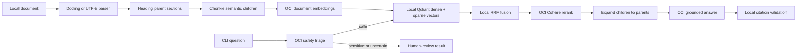

# prodRAG CLI

`prodRAG` is a command-line RAG pipeline for a small technical-document corpus. Parsing and
the Qdrant vector database run locally. OCI Generative AI supplies safety triage, dense
embeddings, reranking, and grounded answer generation.

This branch intentionally contains no HTTP API, upload service, background worker, Redis queue,
or external ticketing integration. Every ingest, query, delete, and evaluation command runs
synchronously in the terminal.

## End-to-end flow



Normal answered queries make four OCI operations: triage, query embedding, reranking, and answer
generation. Sparse encoding, Qdrant search, RRF, parent expansion, confidence grading, and citation
validation remain local. Rich documents are parsed locally, but extracted text is later sent to
OCI for embeddings; selected passages are also sent for reranking and answer generation.

## Requirements

- Python `>=3.13,<3.14`
- [`uv`](https://docs.astral.sh/uv/)
- OCI Generative AI access, policies, compartment OCID, and a supported authentication method
- Optional Docker Desktop only when using the local Qdrant server/HNSW mode

Copy `.env.example` to `.env` and set the OCI values. The embedding model, dimension, and Qdrant
collection must stay aligned; changing the model or dimension requires a new collection and full
re-ingestion.

## Setup: embedded exact Qdrant

This is the simplest CLI setup and needs no Docker service:

```dotenv
QDRANT_PATH=./data/qdrant
QDRANT_HNSW_ENABLED=false
```

```powershell
Set-Location C:\Users\AJay\Documents\ogent\refernce\ocigeniworkshop\prodrag
Copy-Item .env.example .env
$env:UV_CACHE_DIR = Join-Path (Get-Location) '.uv-cache'
uv sync
```

Vectors, sparse terms, document metadata, parent text, and child text are stored under
`./data/qdrant`. Embedded mode performs exact search.

## Setup: local Qdrant server with HNSW

Use this mode to exercise the dense HNSW index while keeping the database local:

```dotenv
QDRANT_URL=http://localhost:6333
QDRANT_PATH=
QDRANT_HNSW_ENABLED=true
QDRANT_HNSW_M=16
QDRANT_HNSW_EF_CONSTRUCT=128
QDRANT_HNSW_EF_SEARCH=128
```

```powershell
docker compose up -d
uv sync
```

The compose file starts only Qdrant and persists it in the `qdrant_data` Docker volume. The
configuration rejects HNSW together with `QDRANT_PATH`, because embedded mode has no HNSW graph.

## Ingest documents

Supported extensions are PDF, DOCX, PPTX, HTML, HTM, Markdown, and TXT.

```powershell
uv run prodrag ingest C:\path\to\technical-docs --tenant default --product router --version 1.0
```

Directory ingestion examines only immediate files, not nested directories. Use `--document-id`
only with a single file. Reusing the same document ID writes the complete new checksum revision
before removing stale points, so a failed update leaves the previous good revision searchable.

Markdown and TXT are read directly. Other supported formats use Docling and are converted to
Markdown locally. Docling may download model assets the first time it parses a PDF; prefetch and
bake these assets into production/offline environments.

## Query

```powershell
uv run prodrag query "How do I rotate the API token?" `
  --tenant default `
  --product router `
  --version 1.0
```

The query is safety-classified before embedding. Sensitive or uncertain questions return a
human-review result without retrieval. Safe questions retrieve 20 dense+sparse RRF candidates,
rerank up to 10, discard rerank scores below `0.15`, and expand up to 5 unique parent sections.
Low retrieval confidence abstains. Generated answers must cite a supplied `[S1]`-style source.

## Delete

```powershell
uv run prodrag delete authentication-guide --tenant default
```

Tenant filtering prevents the same document ID belonging to another tenant from being deleted.

## Evaluate retrieval

JSONL rows follow `eval/example.jsonl`:

```powershell
uv run prodrag-eval .\eval\b2b-saas.jsonl `
  --min-recall 0.95 `
  --min-hit-rate 0.95 `
  --min-abstention 0.90
```

This branch reports recall, hit rate, MRR, and abstention accuracy. It does not currently calculate
precision or accept `--min-precision`. The command exits nonzero when a configured gate fails.

## Main files

- `cli.py`: parses `ingest`, `query`, and `delete` commands.
- `container.py`: connects all reusable clients and services.
- `config.py`: loads and validates `.env` settings.
- `ingestion/parsing.py`: local format conversion and heading parents.
- `ingestion/chunking.py`: semantic child chunks using OCI document embeddings.
- `ingestion/service.py`: deterministic metadata and revision-safe upserts.
- `vector_store.py`: Qdrant collection, exact/HNSW selection, and RRF hybrid search.
- `retrieval/sparse.py`: local BM25-style exact-term vectors.
- `retrieval/reranking.py`: OCI Cohere rerank adapter.
- `retrieval/context.py`: child deduplication and parent expansion.
- `querying.py`: safety-first top-level query orchestration.
- `answering.py`: confidence gate, answer call, and citation enforcement.
- `evaluation.py`: retrieval-only golden-question metrics and gates.

## Default tuning values

| Setting | Default | Meaning |
|---|---:|---|
| Parent section | 12,000 characters | Largest answer-context block under a heading |
| Semantic child | 450 estimated tokens | Focused vector-search unit |
| Semantic threshold | 0.72 | Sensitivity to topic changes between sentence windows |
| Initial candidates | 20 | Dense+sparse RRF child results sent to stage two |
| Final parents | 5 | Maximum unique parent sections for answering |
| Minimum rerank | 0.15 | Weaker candidates are discarded |
| Medium confidence | 0.35 | Minimum strongest score allowed to answer |
| High confidence | 0.75 | Strongest score classified as high confidence |
| Answer budget | 30,000 characters | Total source text across all final parents |
| Dense dimension | 1,536 | OCI and Qdrant vector width |

## Cost estimate

The documented estimate is **USD 3.40 per 1,000 fully answered queries**, covering triage, one
query embedding, one rerank search unit, and grounded answer generation. It excludes ingestion,
local Qdrant compute/storage, retries, networking, taxes, and support plans. Sensitive or safely
abstained queries skip later OCI operations. See `docs/cost-estimate.md` for assumptions and verify
current OCI pricing before budgeting.

## Production checks for this CLI

- Keep `.env` and OCI credentials out of Git.
- Encrypt and back up the local Qdrant path or Docker volume.
- Prefetch Docling assets for offline and repeatable PDF ingestion.
- Do not log document bodies, prompts, credentials, or sensitive questions.
- Re-run golden retrieval evaluation after document, model, chunking, or threshold changes.
- Version the Qdrant collection whenever the embedding model or dimension changes.
